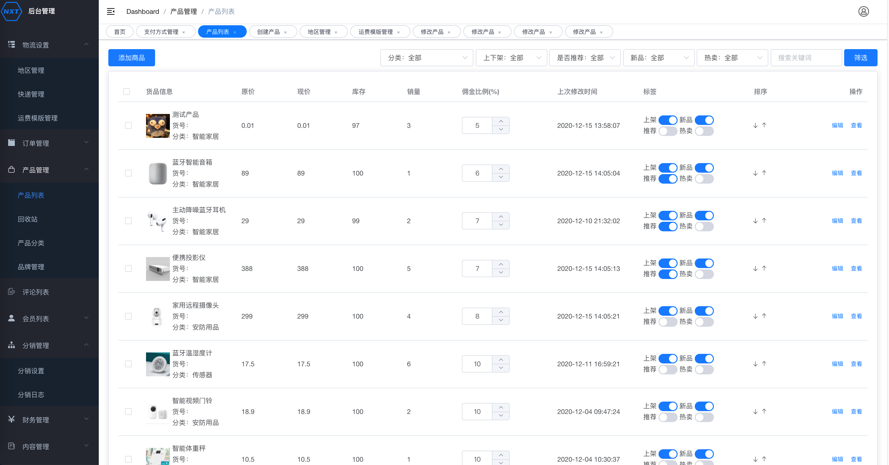
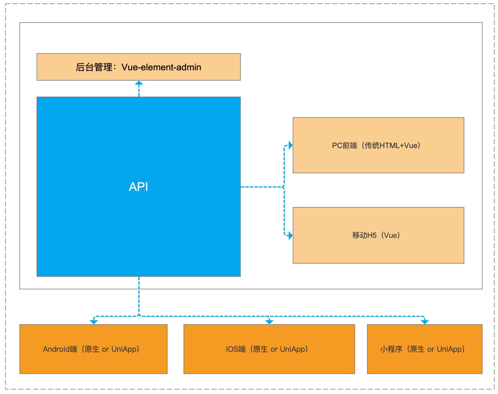
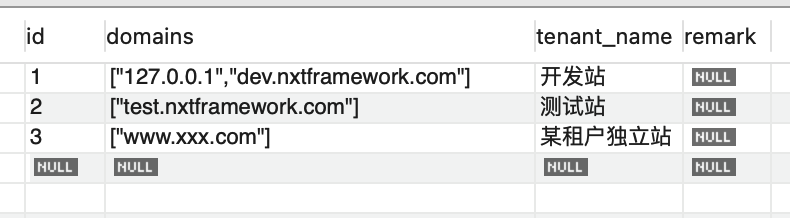
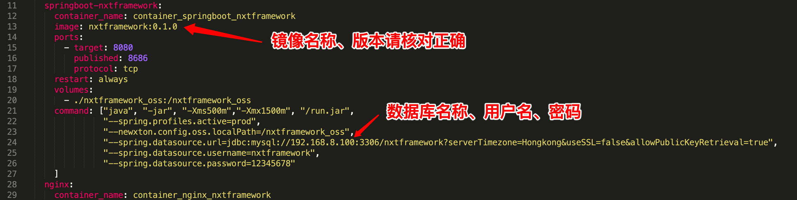

一个开源电商系统，可以既作为B2C单商户使用，又可以作为SAAS系统多商户使用。

支持分销功能。

基于Java Springboot开发，Api文档、数据库文档齐全。


#### 二次开发：

1、Vue-Element-Admin后台源码：https://github.com/soyojoearth/nxtframework_admin

2、Api接口文档：请clone项目后打开 document/nxtframework_api.html

3、数据库结构模型：请clone项目后打开document/nxtframework_db_model.mwb（使用Mysql Workbench 8.0打开）


#### Demo：

1、前台：https://demo.nxtframework.com

2、后台：https://demo.nxtframework.com/admin 

3、用户名：guest 密码：（任意） （后台访客权限，只能看，不能改）


#### 主要涉及到的技术：

1、MySQL 8.0

2、SpringBoot 2

3、Open Jdk 8

4、Docker


#### **特性：**

1、图片可以保存在服务器本地，也可以选择保存在七牛云；

2、上传保存在本地的图片也支持自动生成缩略图（仿七牛云）；

3、可docker-compose一键启动，已配置好nginx文件，支持ssl，只要修改绑定域名和证书文件即可；

4、具备Docker HEALTHCHECK 、Docker autoheal，自动检测健康状态，发现故障自动重启；


#### 后台预览图：




#### 技术架构图：（app端、移动h5端请参考api自行开发，或联系我们提供二次开发服务）




#### 本地测试运行：

**1、用database里面的nxtframework.sql在本机创建数据库，并设置：**

```
数据库名称：nxtframework
数据库用户名：nxtframework
数据库密码：12345678
```

##### 2、给nxt_tenant插入以下记录（一条记录表示一个商户，只加一条就是单商户；加多条就是多商户SaaS系统；每个商户可以按domains字段的格式绑定多个域名）



**3、用IntelliJ IDEA打开项目，运行项目**

##### 4、浏览器输入：`http://127.0.0.1:8080/install`提示安装成功【每个租户都要独立运行该install一次】  

**5、然后浏览器打开：`http://127.0.0.1:8080/admin`  用户名：`admin` 密码：`nxtframework.com`**

##### 6、前台：`http://127.0.0.1:8080`

##### 7、不同商户的数据完全从底层逻辑分割，所有install完成的商户，默认后台都是初始密码和初始数据


#### 单机部署方式：

##### 1、用IntelliJ IDEA打开项目，进行package打包，然后命令行到项目根目录，执行：


```
#创建镜像
docker build --tag nxtframework:0.2.0 .
```

##### 2、把镜像推到docker仓库，并拉到服务器上；

##### 3、把「本地测试运行」合格的数据库，部署到服务器；

##### 4、配置 `wwwroot/docker-compose-quickstart.yml`文件中的docker镜像、数据库连接：

`#不要写127.0.0.1，必须写局域网地址（即便是本机数据库）`



##### 5、把wwwroot目录传到服务器，执行：

```
cd wwwroot
docker-compose -f docker-compose-quickstart.yml up
```

##### 6、浏览器输入：`http://商户域名:8080/install`提示安装成功【每个租户都要独立运行该install一次】

##### 7、然后浏览器打开：`http://商户域名:8686/admin`  用户名：`admin` 密码：`nxtframework.com`


##### 如何启用80端口、部署SSL：

##### 1、本机添加以下hosts

`服务器IP  test.nxtframework.com`

打开浏览器访问：`http://test.nxtframework.com/admin` 和 `https://test.nxtframework.com/admin`

**2、如何更换域名、证书：**

修改`wwwroot/http/nginx.conf`文件，将域名修改成自己的域名；

更换`wwwroot/http/ssl*` 两个证书文件；


##### 添加商户（租户）：

1、每次添加商户，都到后台数据库表nxt_tenant里面手动添加；

2、把新加商户的域名加入Nginx；

3、把新加商户的ssl证书加入Nginx；


#### 集群部署方式：

1、建议用使用k8s部署；

2、部署完成^_^。

本项目已经充分考虑过集群多实例部署的情况，已针对性优化过。


#### 开发团队成员：

Leader & PM：soyojo

UI设计：Rong Kai

架构：soyojo

后端开发：soyojo、hexiao、yunian

前端开发：soyojo、ieyieyss、阿 Fa、hexiao、Remondcl、yunian


#### 如需要我们团队进行二次开发或者洽谈商业授权事宜，请加微信：

